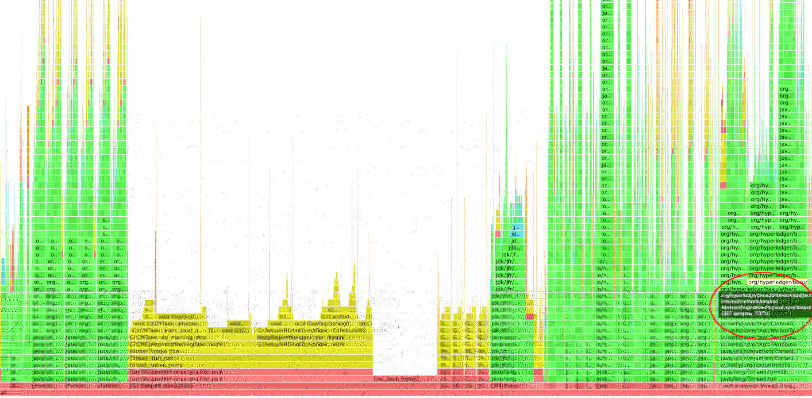

# Profiling Besu with `asprof`

This guide explains how to set up and run [Async Profiler](https://github.com/jvm-profiling-tools/async-profiler) to profile a running Besu instance.

---

## 1. Setup

### a. Download and Extract

Download version 4.0 of Async Profiler appropriate for your architecture:

- For **x86_64**:
  ```bash
  wget https://github.com/async-profiler/async-profiler/releases/download/v4.0/async-profiler-4.0-linux-x64.tar.gz
  ```
- For **arm64**:
  ```bash
  wget https://github.com/async-profiler/async-profiler/releases/download/v4.0/async-profiler-4.0-linux-arm64.tar.gz
  ```

Extract it to a shared location, such as `/opt/besu`:

```bash
sudo mkdir -p /opt/besu
sudo tar -xzf async-profiler-4.0-linux-*.tar.gz -C /opt/besu
```

### b. Configure System Settings

Run the following to ensure the profiler has necessary kernel access:

```bash
sudo sysctl kernel.kptr_restrict=0
sudo sysctl kernel.perf_event_paranoid=1
```

These settings may need to be re-applied after a reboot.

---

## 2. Determine CPU Architecture

Check system architecture to choose the correct profiling event:

```bash
uname -m
```

- `x86_64`: Use `-e wall` for wall-clock profiling.
- `arm64` or `aarch64`: Use `-e cpu`, since `-e wall` is unstable on ARM.

---

## 3. Run the Profiler

The profiler **must be run as the same user** running the Besu process (e.g., `execution`). Replace `<PID>` with the actual Besu process ID. If the Besu process is running as `root`, you can use:

```bash
sudo /opt/besu/async-profiler-4.0-linux-*/bin/asprof \
  -d 300 \
  -e [wall|cpu] \
  -t \
  -i 11ms \
  -f /tmp/besu-profile.html \
  <PID>
```

Should you need to run it as a specific user (e.g., `execution`), use:

```bash
sudo -u execution /opt/besu/async-profiler-4.0-linux-*/bin/asprof \
  -d 300 \
  -e [wall|cpu] \
  -t \
  -i 11ms \
  -f /tmp/besu-profile.html \
  <PID>
```

### Flag explanation

- `-d 300`: Profile duration in seconds.
- `-e wall|cpu`: Profiling event based on architecture.
- `-t`: Include thread stack traces.
- `-i 11ms`: Sampling interval.
- `-f`: Output HTML flamegraph path.

---

## 4. Analyze the Results

Once complete, open the generated flamegraph (e.g., `/tmp/besu-profile.html`) in your browser to analyze performance bottlenecks.

It will look something like this:



The highlighted area shows the most performance-critical section of the flamegraph, revealing the methods in Besu that consume the most time during block processing.
