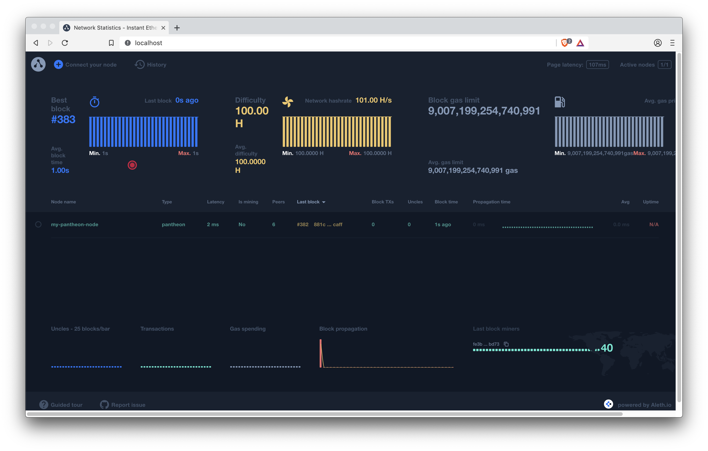

description: Alethio EthStats Lite Network Monitor
<!--- END of page meta data -->

# Alethio EthStats Lite Network Monitor

Use the [Alethio EthStats Lite Network Monitor](https://github.com/Alethio?utf8=%E2%9C%93&q=ethstats&type=&language=javascript)
to have a live view of private network health by displaying real time and historical statistics 
about the network and nodes.

The lite version supports in-memory persistence or using Redis to persist a fixed number of blocks
(by default, 3000). 

You can also use a full online version of EthStats Network Monitor for the [Ethereum MainNet](https://ethstats.io).

!!! note 
    The Alethio EthStats Lite Network Monitor is an [Alethio product](https://company.aleth.io/developers).

!!! tip
    Static local ports 80 and 3000 are used in the example [running the Lite Network Monitor 
    for a Pantheon Node](#running-lite-network-monitor-for-a-pantheon-node).  

## Statistics

Statistics displayed by the Network Monitor include: 

* Nodes in the network. Metrics for nodes include:
    - Information about the last received block such as block number, 
block hash, transaction count, uncle count, block time and propagation time 
    - Connected peers, whether the node is mining, hash rate, latency, and uptime
* Charts for Block Time, Block Difficulty, Block Gas Limit, Block Uncles, Block Transactions, Block Gas Used, 
Block Propagation Histogram, and Top Miners
* IP based geolocation overview
* Node logs. Node logs display the data sent by a node
* Block history.  Block history provides the ability to go back in time and playback the block propagation
 through the nodes
 
## Components 

The Network Monitor consists of: 

* [Server](https://github.com/Alethio/ethstats-network-server). Consumes node data received from the 
client. 

* [Client](https://github.com/Alethio/ethstats-cli). A client must be started for each node in the network.
The client extracts data from the node and sends it to the server

* [Dashboard](https://github.com/Alethio/ethstats-network-dashboard). Dashboard displaying [statistics](#statistics).

## Pre-requisities 

[Docker](https://docs.docker.com/install/)

!!! tip
    The Network Monitor has a number of dependencies. Using Docker is the easiest way to
    use the Network Monitor with Pantheon.
    
    The [EthStats CLI](https://github.com/Alethio/ethstats-cli),
    [EthStats Network Server](https://github.com/Alethio/ethstats-network-server), and [EthStats Network
    Dashboard](https://github.com/Alethio/ethstats-network-dashboard) documentation describes how to 
    install the Network Monitor tools. 

## Running Lite Network Monitor for a Pantheon Node

!!! important
    This  example describes how to run the Lite Network Monitor for a single Pantheon node. To run the 
    Lite Network Monitor for a network of nodes, a [client](#3-client) must be started for each node. 

### 1. Server

Start the server using in-memory persistence: 

1. Clone the server repository: 

    ```bash
    git clone https://github.com/Alethio/ethstats-network-server.git
    ```

1. Change into the `/ethstats-network-server/docker/lite-mode/memory-persistence` directory:
   
    ```bash
    cd ethstats-network-server/docker/lite-mode/memory-persistence
    ```

1. Update the `docker-compose.yml` file to your Pantheon [network ID](../Configuring-Pantheon/NetworkID-And-ChainID.md):
    
    ```yaml
     - NETWORK_ID=2018
     - NETWORK_NAME=mynetwork
    ```
    
    In this example we are using the `dev` Pantheon network with a network ID of `2018`.      
    
1. Start the server using Docker compose: 

    ```bash
    docker-compose up -d
    ```
   
!!! tip
    A `docker-compose` file is provided in the `ethstats-network-server/docker/lite-mode/redis-persistence`
    directory to run the server using Redis to persist a fixed number of blocks (default is 3000).

### 2. Pantheon 

Start Pantheon in development mode with Websockets enabled:

```bash
docker run --rm -p 8546:8546 pegasyseng/pantheon:latest --miner-enabled --miner-coinbase fe3b557e8fb62b89f4916b721be55ceb828dbd73 --rpc-http-cors-origins="all" --rpc-ws-enabled --network=dev
```

Where `<pantheondata-path>` is the volume to which the node data is saved. 

### 3. Client 

Start the client for the Pantheon node:  

```bash
docker run -d --rm --name ethstats-client --net host alethio/ethstats-cli --register --account-email <email> --node-name <node_name> --server-url http://localhost:3000 --client-url ws://127.0.0.1:8546
```

Where: 

* `--server-url` specifies [your server](#1-server). The default is the server that consumes data for the Ethereum MainNet.
* `--register` specifies the registration of the Pantheon node is done automatically with the specified `<email>` and `<node_name>`. 
Registering the node is only required the first time the client is started for the node.
* `--client-url` specifies the WebSockets URL for the Pantheon node.    

### 4. Dashboard 

To display the Network Monitor dashboard, open [http://localhost](http://localhost) in your browser. 



!!! note "Default HTTP port"
    We are using the default HTTP port (80) to run the Lite Network Monitor. The [Lite Block Explorer](Lite-Block-Explorer.md) 
    example uses port 8080. You can then run both at the same time.
 
    To change the port, update the `docker-compose.yml` file:
    ```yaml
        ports:
          - 127.0.0.1:80:80
    ```
    
    Update the first 80 to the required port:
    ```yaml
        ports:
          - 127.0.0.1:8081:80
    ```

### Stopping and Cleaning Up Resources

When you've finished running the Network Monitor:

1. Stop Pantheon using ++ctrl+c++.  

1. Stop the server and remove containers and volumes: 

    ```bash
    docker-compose down -v
    ```  
  
1. Stop the client: 
   
    ```bash
    docker stop ethstats-client
    ```
    
    !!! tip
        The client container is automatically removed because we used the `--rm` option.