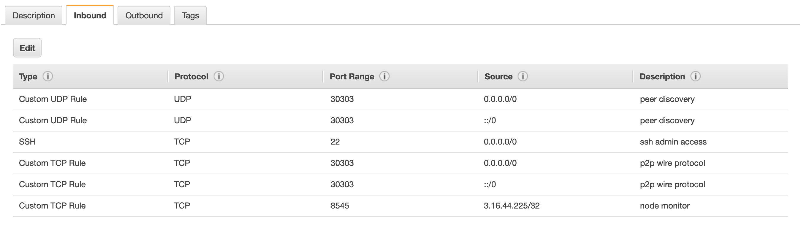

description: Ports must be exposed appropriately to enable communication
<!--- END of page meta data -->

# Configuring Ports 

Ports must be exposed appropriately to enable communication. An example port configuration for a Pantheon node on AWS is: 
                                     

When running Pantheon from the [Docker image](../../Getting-Started/Run-Docker-Image.md), [expose ports](../../Getting-Started/Run-Docker-Image.md#exposing-ports). 

## P2P Networking 

To enable peer discovery, the P2P UDP port must be open for inbound connections.

We also recommended opening the P2P TCP port for inbound connections. This is not strictly required because 
Pantheon attempts to initiate outbound TCP connections. However, if no nodes on the network are accepting inbound TCP 
connections, nodes cannot communicate.

The P2P port is specified by the [`--p2p-port`](../../Reference/Pantheon-CLI-Syntax.md#p2p-port) option. 
The default is `30303`. 

## JSON-RPC API 

To enable access to the [JSON-RPC API](../../JSON-RPC-API/JSON-RPC-API.md), open the HTTP JSON-RPC and WebSockets JSON-RPC ports to the intended users 
of the JSON-RPC API on TCP. 

The [`--rpc-http-port`](../../Reference/Pantheon-CLI-Syntax.md#rpc-http-port) and [`--rpc-ws-port`](../../Reference/Pantheon-CLI-Syntax.md#rpc-ws-port) 
options specify the HTTP and WebSockets JSON-RPC ports. The defaults are `8545` and `8546`.  

## Metrics 

To enable [Prometheus to access Pantheon](../../Using-Pantheon/Debugging.md#monitor-node-performance-using-prometheus), 
open the metrics port or metrics push port to Prometheus or the Prometheus push gateway on TCP.  

The [`--metrics-port`](../../Reference/Pantheon-CLI-Syntax.md#metrics-port) and [`--metrics-push-port`](../../Reference/Pantheon-CLI-Syntax.md#metrics-push-port) 
options specify the ports for Prometheus and Prometheus push gateway. The defaults are `9545` and `9001`.  