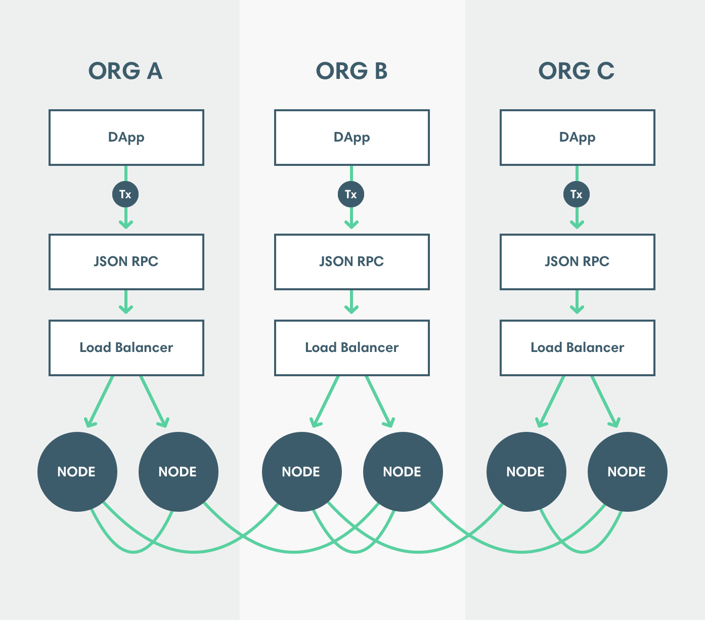

description: Pantheon high availability 
<!--- END of page meta data -->

# High Availability of JSON-RPC and RPC Rub/Sub APIs

To enable high availability to the [RPC Pub/Sub API over WebSockets](../Pantheon-API/RPC-PubSub.md) 
or the [JSON-RPC API](../Pantheon-API/Using-JSON-RPC-API.md) run and synchronize multiple Pantheon 
nodes to the network. Use a load balancer to distribute requests across nodes in the cluster that 
are ready to receive requests. 

## Determining When a Node is Ready 

Use the [readiness endpoint](../Pantheon-API/Using-JSON-RPC-API.md#readiness-and-liveness-endpoints) 
to determine when a node is ready. 

!!! note
    The minimum number of peers and number of blocks from the best known block for a node to be considered ready
    is deployment specific. 

## Transaction Nonces 

The account nonce for the next transaction is obtained using [`eth_getTransactionCount`](../Reference/Pantheon-API-Methods.md#eth_gettransactioncount). 
The account nonce depends on the transactions in the [transaction pool](../Using-Pantheon/Transactions/Transaction-Pool.md).
If [`eth_getTransactionCount`](../Reference/Pantheon-API-Methods.md#eth_gettransactioncount) and 
[`eth_sendRawTransaction`](../Reference/Pantheon-API-Methods.md#eth_sendrawtransaction) requests for a specific account 
are sent to multiple nodes, the [`eth_getTransactionCount`](../Reference/Pantheon-API-Methods.md#eth_gettransactioncount)
results can be incorrect. 

!!! note
    If using [private transactions](../Privacy/Explanation/Privacy-Overview.md), `priv_getTransactionCount` is used to obtain 
    the account nonce and [`eea_sendRawTransaction`](../Reference/Pantheon-API-Methods.md#eea_sendrawtransaction)
    to send private transactions. 

To get correct account nonces when distributing requests across a cluster, do one of:  

* Track the next nonce outside of the Pantheon node (as MetaMask does)
* Configure the load balancer in sticky mode so requests from a specific account are sent to a single 
node unless that node is unavailable. 

## Subscriptions 

You can subscribe to events using:  

* [RPC Pub/Sub over WebSockets](../Pantheon-API/RPC-PubSub.md) 
* [Filters over HTTP](../Using-Pantheon/Accessing-Logs-Using-JSON-RPC.md) 

We recommend using [RPC Pub/Sub over WebSockets](../Pantheon-API/RPC-PubSub.md) because WebSockets 
connections are associated a specific node and do not require using the load balancer in sticky mode. 

If using [filters over HTTP](../Using-Pantheon/Accessing-Logs-Using-JSON-RPC.md), configure the load balancer 
in sticky mode to associate the subscription with a specific node. 

## Recovering from Dropped Subscriptions 

Subscriptions can be dropped if: 

* WebSockets connection is disconnected
* Node serving the subscription is removed from the ready pool 

If a subscription is dropped, events can be missed while reconnecting to a different node. 
To recover dropped messages, create another subscription and follow the process for that [subscription type](../Pantheon-API/RPC-PubSub.md#subscribing):  

* [`newHeads`](#new-headers)
* [`logs`](#logs)
* [`newPendingTransactions`](#new-pending-transactions)
* [`droppedPendingTransactions`](#dropped-pending-transactions)
* [`syncing`](#syncing)

### New Headers

Use [`eth_getBlockByNumber`](../Reference/Pantheon-API-Methods.md#eth_getblockbynumber) to request information on 
blocks from the last block before the subscription dropped to the first block received from the new subscription.

### Logs 

Use [`eth_getLogs`](../Reference/Pantheon-API-Methods.md#eth_getlogs) to request logs from the block number 
of the last log received before the subscription dropped to the current chain head.

### New Pending Transactions

Use [`txpool_pantheonTransactions`](../Reference/Pantheon-API-Methods.md#txpool_pantheontransactions) to 
request all pending transactions for the new node.

!!! note
    Nodes do not all store the same pending transactions.

### Dropped Pending Transactions

Use [`txpool_pantheonTransactions`](../Reference/Pantheon-API-Methods.md#txpool_pantheontransactions) to 
request all pending transactions for the new node.

!!! note
    Nodes do not all store the same pending transactions.

### Syncing

The syncing state of each node is specific to that node. Use [`eth_syncing`](../Reference/Pantheon-API-Methods.md#eth_syncing)
to retrieve the syncing state of the new node.
