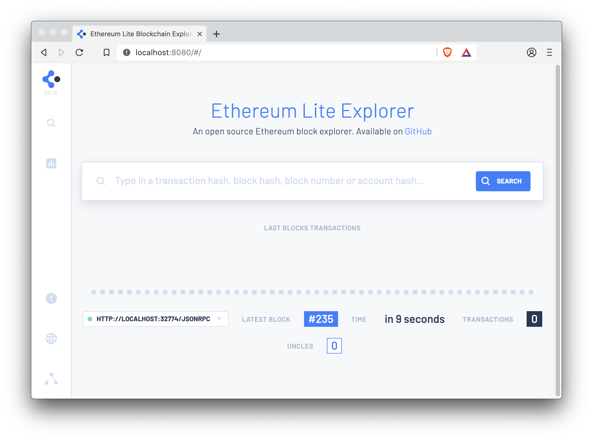

description: Ethereum Lite Explorer
<!--- END of page meta data -->

# Alethio Ethereum Lite Explorer

Use the [Alethio Ethereum Lite Explorer](https://lite-explorer.aleth.io/) to explore blockchain data 
at the block, transaction, and account level.
 
The Alethio Ethereum Lite Explorer is a web application that connects to any Ethereum 
JSON-RPC enabled node. No online server, hosting, or trusting third parties to display the blockchain
data is required. 

!!! note 
     The Alethio Ethereum Lite Explorer is an [Alethio product](https://company.aleth.io/developers).

## Prerequisites

[Docker](https://docs.docker.com/install/) or [Node.js](https://nodejs.org/)

!!! tip
    Using Docker is the easiest way to get started using the Ethereum Lite Explorer with Pantheon if you 
    do not have Node.js installed.

## Run Using Docker

To run the Ethereum Lite Explorer using the Docker image: 

1. Start Pantheon with the [`--rpc-http-enabled`](../../Reference/Pantheon-CLI-Syntax.md#rpc-http-enabled) option. 

    !!! example 
        
        To run Pantheon in development mode:
        
        ```bash
        pantheon --network=dev --miner-enabled --miner-coinbase=0xfe3b557e8fb62b89f4916b721be55ceb828dbd73 --rpc-http-cors-origins="all" --host-whitelist="*" --rpc-http-enabled --data-path=/tmp/tmpDatdir
        ```

1. Run the `alethio/ethereum-lite-explorer` Docker image specifying the JSON-RPC HTTP URL (`http://localhost:8545` in this example): 

    ```bash
    docker run --rm -p 8080:80 -e APP_NODE_URL=http://localhost:8545 alethio/ethereum-lite-explorer
    ```

1. Open [http://localhost:8080](http://localhost:8080) in your browser to view the Lite Explorer. 

    

    !!! note "Default HTTP port"
        We are using port 8080 to run the Ethereum Lite Explorer so
        the [EthStats Lite](Lite-Network-Monitor.md) can use port 80. You can then run 
        both at the same time. 

## Install and Run with Node.js

1. Clone the `ethereum-lite-explorer` repository: 
   
    ```bash
    git clone https://github.com/Alethio/ethereum-lite-explorer.git
    ```

1. Change into the `ethereum-lite-explorer` directory: 
   ```bash
   cd ethereum-lite-explorer
   ```

1. Install npm packages: 

    ```bash
    npm install
    ```

1. Copy the sample config: 

    ```bash 
    cp config.default.json config.dev.json
    ```
  
1. Update the `config.dev.json` file: 

    * Set `APP_NODE_URL` to the JSON-RPC HTTP URL of your node (`http://localhost:8545` in this example)
   
    * Remove other environment variables. 
   
1. In another terminal, start Pantheon with the [`--rpc-http-enabled`](../../Reference/Pantheon-CLI-Syntax.md#rpc-http-enabled) option. 

    !!! example 
        
        To run Pantheon in development mode:
        
        ```bash
        pantheon --network=dev --miner-enabled --miner-coinbase=0xfe3b557e8fb62b89f4916b721be55ceb828dbd73 --rpc-http-cors-origins="all" --host-whitelist="*" --rpc-http-enabled --data-path=/tmp/tmpDatdir
        ```
        
1. In the `ethereum-lite-explorer` directory, run the Lite Explorer in development mode: 

    ```bash
    npm run build
    npm run start
    ```  
   
1. A browser window displays the Ethereum Lite Explorer (http://localhost:3000/).
   
## Lite Block Explorer Documentation 

See the Ethereum Lite Explorer [GitHub repository](https://github.com/Alethio/ethereum-lite-explorer) 
for more documentation, including details on deploying it. 
