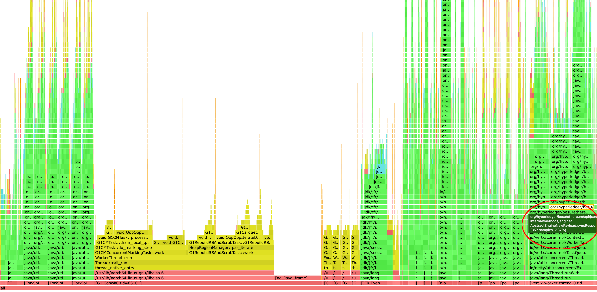

# Profiling Besu with Async Profiler (asprof)

This guide explains how to set up and run [Async Profiler](https://github.com/async-profiler/async-profiler) to profile a running Besu instance.

---

## Setup

### Download and Extract

Please refer to the release page of [Async Profiler](https://github.com/async-profiler/async-profiler/releases) to check for the latest version.

For example to download version 4.0 appropriate for your architecture:

- For **x86_64**:
  ```bash
  wget https://github.com/async-profiler/async-profiler/releases/download/v4.0/async-profiler-4.0-linux-x64.tar.gz
  ```
- For **arm64**:
  ```bash
  wget https://github.com/async-profiler/async-profiler/releases/download/v4.0/async-profiler-4.0-linux-arm64.tar.gz
  ```

Extract it to a shared location, such as `/opt/besu`:

```bash
sudo mkdir -p /opt/besu
sudo tar -xzf async-profiler-4.0-linux-*.tar.gz -C /opt/besu/async-profiler-4.0:
```

### Configure System Settings

Run the following to ensure the profiler has necessary kernel access:

```bash
sudo sysctl kernel.kptr_restrict=0
sudo sysctl kernel.perf_event_paranoid=1
```

These settings may need to be re-applied after a reboot.

---

## Determine CPU Architecture

Check system architecture to choose the correct profiling event:

```bash
uname -m
```

- `x86_64`: All events are stable
- `arm64` or `aarch64`: `-e wall` is unstable on ARM in general. Use `-e cpu` for CPU profiling and add `--cstack vm` to avoid AsyncGetCallTrace related JVM bugs.

---

## 3. Run the Profiler

The profiler **must be run as the same user** running the Besu process (e.g., `execution`). Replace `<PID>` with the actual Besu process ID. If the Besu process is running as `root`, you can use:

```bash
sudo /opt/besu/async-profiler-4.0-linux-*/bin/asprof \
  -d 300 \
  -e [wall|cpu] \
  --cstack vm \
  -t \
  -i 11ms \
  -f /tmp/besu-profile.html \
  <PID>
```

Should you need to run it as a specific user (e.g., `execution`), use:

```bash
sudo -u execution /opt/besu/async-profiler-4.0-linux-*/bin/asprof \
  -d 300 \
  -e [wall|cpu] \
  --cstack vm \
  -t \
  -i 11ms \
  -f /tmp/besu-profile.html \
  <PID>
```

### Profiling Options Explained

- `-d 300`: Profile duration in seconds.
- `-e wall|cpu`: Profiling event based on architecture.
- `-t`: Profile threads separately.
- `-i 11ms`: Sampling interval.
- `-f`: Output HTML flamegraph path.

---

## Analyze the Results

Once complete, open the generated flamegraph (e.g., `/tmp/besu-profile.html`) in your browser to analyze performance bottlenecks.

#### How to read the flamegraph

- Top boxes: Show the methods actively running when CPU samples were taken.
- Boxes underneath: Represent the call stack leading up to the active methods (top boxes).

The width of each box shows how much total time was spent in this method (including any methods it called):

- Wide boxes = Potential hot spots.
- Tall stacks = Deep call chains.

It will look something like this:



The highlighted area shows the most performance-critical section of the flamegraph, revealing the methods in Besu that consume the most time during block processing.


## Troubleshooting

If you experience any issues while using the profiler, refer to the official troubleshooting guide for solutions and common pitfalls:
[Async Profiler Troubleshooting Guide](https://github.com/async-profiler/async-profiler/blob/5fffdb1eaa538b20e5990ca6b96898ffa157fc91/docs/Troubleshooting.md)

### Additional Notes

#### JDK-specific issues
Some problems are caused by bugs or limitations in the JDK itself (e.g., AsyncGetCallTrace stability).
* Check if the issue is known for your JDK version.
* Sometimes upgrading to a newer JDK resolves the problem.

#### Nightly builds
Async Profiler regularly fixes issues in nightly builds that are not yet available in stable releases.
* If you encounter problems (especially crashes), try the nightly build.
* Be aware that nightly builds may include experimental changes.

#### JVM crashes
If your JVM crashes while using Async Profiler:
* Inspect the JVM crash logs for clues about the error.
* Check the GitHub issues to see if:
  * There is a known issue matching your crash.
  * There is a workaround (e.g., using --cstack vm).
  * There is a fix available in a newer JDK version.
  * There is a fix included in the Async Profiler nightly builds.
