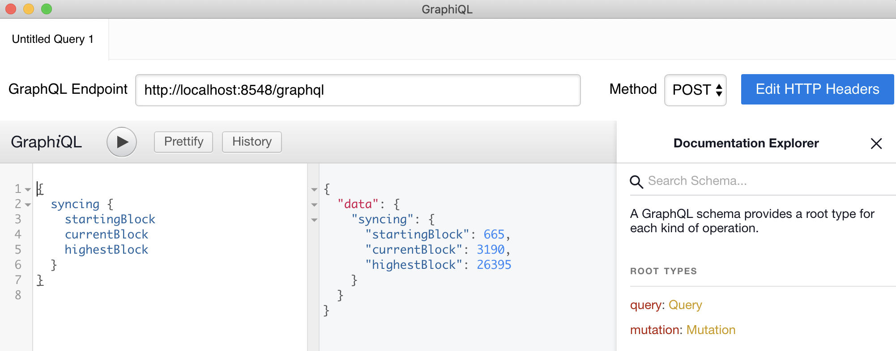

description: How to access the Pantheon API using GraphQL
<!--- END of page meta data -->

# GraphQL over HTTP

GraphQL can reduce the overhead needed for common queries. For example, instead of querying each receipt in a
block, GraphQL can obtain the same result with a single query for the entire block. 

## GraphQL Requests with Curl 

[Pantheon JSON-RPC API methods](../Reference/Pantheon-API-Methods.md) with an equivalent [GraphQL](../Pantheon-API/GraphQL.md) 
query include a GraphQL request and result in the method example. 

!!! example
    The following [`syncing`](../Reference/Pantheon-API-Methods.md#eth_syncing) request returns data about the synchronization status.
    ```bash
    curl -X POST -H "Content-Type: application/json" --data '{ "query": "{syncing{startingBlock currentBlock highestBlock}}"}' http://localhost:8547/graphql
    ```

## GraphQL Requests with GraphiQL App

The third-party tool [GraphiQL](https://github.com/skevy/graphiql-app) provides a tabbed interface for editing and testing GraphQL 
queries and mutations. GraphiQL also provides access the Pantheon GraphQL schema from within the app. 

 


 