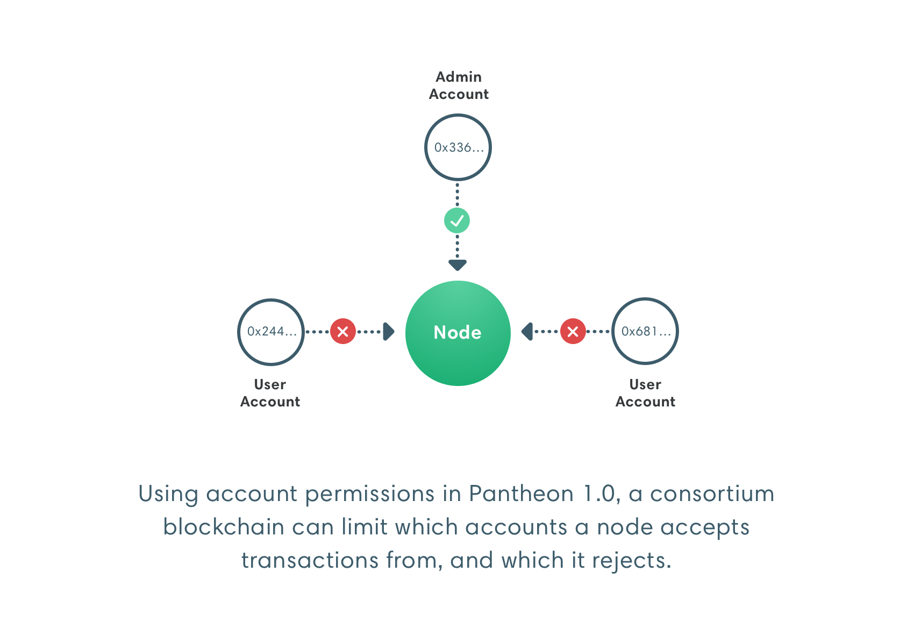

description: Pantheon Permissioning feature
<!--- END of page meta data -->

# Permissioning 

A permissioned network allows only specified nodes and accounts to participate by enabling node permissioning and/or 
account permissioning on the network.  

!!! important "Permissioning is not Privacy"
    In peer-to-peer networks, node permissioning enforces rules on nodes you control. 
         
    Permissioning requires a distributed network of trust across the network where participants agree to 
    follow the rules. A single bad actor can decide not to follow the rules. Nodes can take action 
    to prevent the bad actor adding to the chain but they cannot prevent the bad actor from allowing access to the chain.  
    
    Pantheon also implements [privacy](../Privacy/Explanation/Privacy-Overview.md).
    
## Node Permissioning 

Use node permissioning to restrict access to known participants only. 

## Account Permissioning 

Use account permissioning: 

* Enforce onboarding or identity requirements
* Suspend accounts
* Blacklist broken contracts 
* Restrict the actions an account can perform 

## Specifying Permissioning 

Permissioning is [local](#local) or [onchain](#onchain).

### Local 

[Local permissioning](Local-Permissioning.md) is specified at the node level. Each node in the network has a [permissions configuration file](#permissions-configuration-file).

Local permissioning affects your node but not the rest of the network. Use local permissioning to restrict use 
of your node (that is, the resources under your control). For example, customers that can access your node. 

Local permissioning doesn't require co-ordination with the rest of the network and you can act immediately to
protect your node. Your rules are not enforced in blocks produced by other nodes. 

### Onchain 

[Onchain permissioning](Onchain-Permissioning.md) is specified in a smart contract on the network. Specifying permissioning onchain
enables all nodes to read and update permissioning in one location. 

Onchain permissioning requires co-ordination to update rules. The network may not be able to act immediately 
(for example, the smart contract may enforce a minimum of votes before changing permissioning rules). 

When onchain permissioning is updated, the update is applied across the network and new blocks abide by the updated rules. 
For example, blocked accounts can no longer add transactions to the chain.