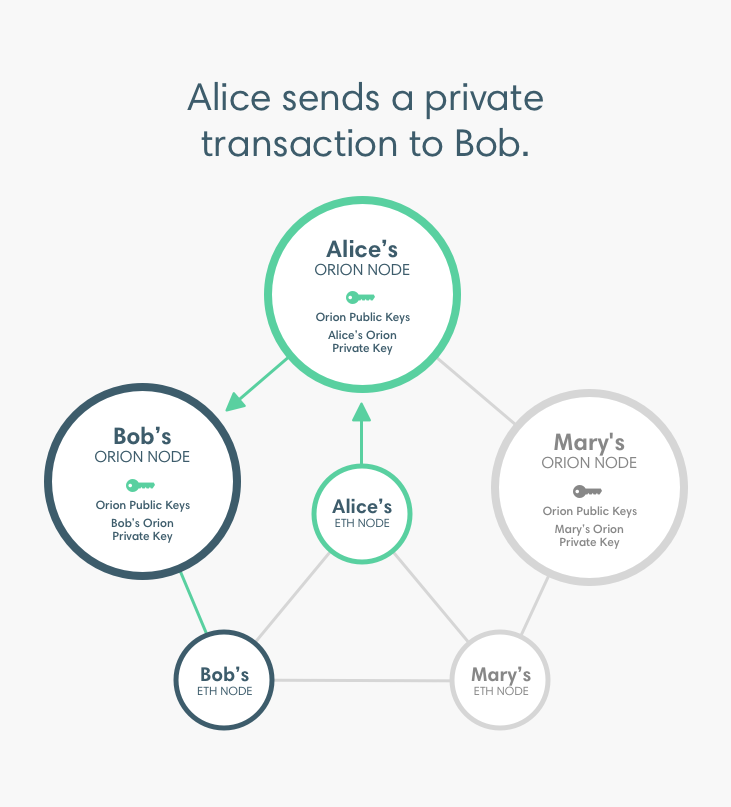

description: Privacy
<!--- END of page meta data -->

# Privacy

Privacy in Pantheon refers to the ability to keep transactions private between the involved parties. 
Other parties cannot access the transaction content, sending party, or list of participating parties. 

!!! important
    For production systems requiring private transactions, we recommend using a network 
    with a consensus mechanism supporting transaction finality. For example, [IBFT 2.0](../../Consensus-Protocols/IBFT.md). 

## Private Transaction Manager

Pantheon uses a Private Transaction Manager to implement privacy. For example, [Orion](http://docs.orion.pegasys.tech).  
Each Pantheon node that sends or receives private transactions requires an associated Orion node. 

Private transactions are passed from the Pantheon node to the associated Orion node. The Orion node
encrypts and directly distributes (that is, point to point) the private transaction to Orion nodes 
participating in the transaction. 

!!! tip
    Private Transaction Managers are also known as Enclaves.  

## Private Transaction Attributes

Private transactions have additional attributes to public Ethereum transactions: 

* `privateFrom` - Orion public key of transaction sender

* `privateFor` - Orion public keys of transaction recipients 

* `restriction` - Private transactions are `restricted` or `unrestricted`:  
  
    - In `restricted` private transactions the payload of the private transaction is received and stored only by 
    the nodes participating in the transaction. 

    - In `unrestricted` private transactions the payload of the private transaction is transmitted to all nodes
    in the network but is readable only by nodes participating in the transaction.   

    !!! important 
        Pantheon implements `restricted` private transactions only.

## Pantheon and Orion Keys

Pantheon and Orion nodes both have public/private key pairs identifying them. The private transaction 
submitted from the Pantheon node to the Orion node is signed with the Pantheon node private key. The 
`privateFrom` and `privateFor` attributes specified in the RLP-encoded transaction string for 
[`eea_sendRawTransaction`](../../Reference/Pantheon-API-Methods.md#eea_sendrawtransaction) are the public keys
of the Orion nodes sending and receiving the transaction.  

!!! important 
    The mapping of Pantheon node addresses to Orion node public keys is off-chain.  That is, the 
    sender of a private transaction must know the Orion node public key of the recipient.  
 
## Privacy Groups 

The group of nodes specified by `privateFrom`and `privateFor` form a privacy group and 
are given a unique privacy group ID by Orion. The private transaction is stored in Orion with the privacy group ID. 

The Pantheon nodes maintain the public world state for the blockchain and a private state for each privacy group. 
The private states contain data that is not shared in the globally replicated world state. Private transactions read 
and write to the private world state for the privacy group, and read from the public world state.

!!! note
    The Orion nodes are not shown above for clarity only.  To send private transactions, 
    each Pantheon node must have an associated Orion node. 

!!! example 
    The above illustrates two privacy groups enabling: 

    * A, B, and C to send transactions that are private from D 
    * A, C, and D to send transactions that are private from B 

    To send private transactions between A, B, and C, A initialises a contract in a private transaction with
    B and C specified as the `privateFor` and A specified as the `privateFrom`. Initialising the contract 
    creates a privacy group consisting of A, B, and C. For the ABC private state to remain consistent, 
    A, B, and C must be included on transactions (as either `privateFrom` or `privateFor`) even if they are 
    between two of the three parties.

    To send private transactions between A, C, and D, C initialises a different contract in a private transaction with
    A and D specified as the `privateFor` and C specified as the `privateFrom`. Initialising the contract 
    creates a privacy group consisting of  A, C, and D. For the ACD private state to remain consistent, 
    A, C, and D must be included on transactions (as either `privateFrom` or `privateFor`) even if they are 
    between two of the three parties.
