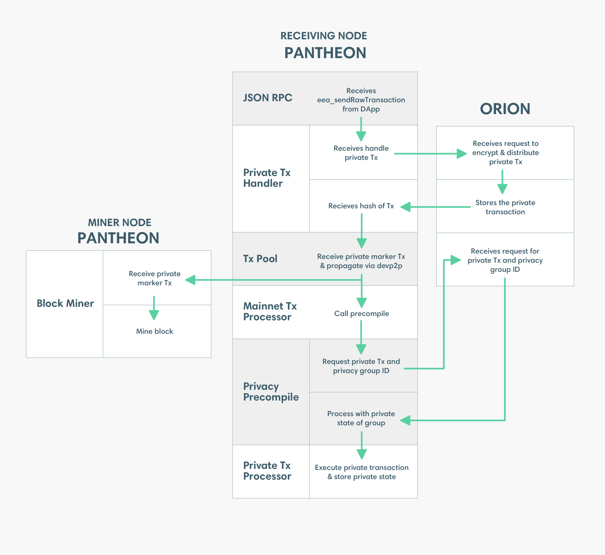

description: Private Transaction Processing
<!--- END of page meta data -->

# Processing Private Transactions

Processing private transactions involves the following: 

- **Precompiled Contract**: Smart contract compiled from the source language to EVM bytecode and stored by an 
Ethereum node for later execution.

- **Privacy Marker Transaction**: Public Ethereum transaction with a payload of the transaction hash of the 
private transaction. The `to` attribute of the Privacy Marker Transaction is the address of the privacy precompile contract. 
The Privacy Marker Transaction is signed with the [Ethereum node private key](../../Configuring-Pantheon/Node-Keys.md#node-private-key).

Private transactions are processed as illustrated and described below.  

1. A private transaction is submitted using [eea_sendRawTransaction](../../Reference/Pantheon-API-Methods.md#eea_sendrawtransaction). 
The signed transaction includes transaction attributes that are specific to private transactions: 

    * `privateFor` or `privacyGroupId` specifies the list of recipients
    * `privateFrom` specifies the sender
    * `restriction` specifies the transaction is of type [_restricted_](Privacy-Overview.md#private-transactions)
 
1. The JSON-RPC endpoint passes the private transaction to the Private Transaction Handler.

1. The Private Transaction Handler sends the private transaction to Orion. 

1. Orion distributes the private transaction directly (that is, point-to-point) to the Orion nodes specified 
in `privateFor` or belonging to the privacy group identified by `privacyGroupId`. All recipient Orion nodes store the transaction. 
The stored transaction is associated with the transaction hash and privacy group ID.

1. Orion returns the transaction hash to the Private Transaction Handler.
     
1. The Private Transaction Handler creates a [Privacy Marker Transaction](Privacy-Overview.md#privacy-concepts) for the private 
transaction. The Privacy Marker Transaction is propagated using devP2P in the same way as a public Ethereum transaction. 

1. The Privacy Marker Transaction is mined into a block and distributed to all Ethereum nodes in the network. 

1. The Mainnet Transaction Processor processes the Privacy Marker Transaction in the same way as any other public transaction. 
On nodes that contain the privacy precompile contract specified in the `to` attribute of the Privacy Marker Transaction, 
the Privacy Marker Transaction is passed to the privacy precompile contract.

    !!! note 
        Nodes receiving the Privacy Marker Transaction that do not contain the privacy precompile contract  
        specified in the Privacy Marker Transaction ignore the Privacy Marker Transaction. 

1. The privacy precompile contract queries Orion for the private transaction and privacy group ID using the 
transaction hash.

1. The privacy precompile contract passes the private transaction to the Private Transaction Processor.
The privacy group ID specifies the private world state to use. 

1. The Private Transaction Processor executes the transaction. The Private Transaction Processor can read and write to 
the private world state, and read from the public world state.

!!! important
    For production systems requiring private transactions, we recommend using a network 
    with a consensus mechanism supporting transaction finality. For example, [IBFT 2.0](../../Consensus-Protocols/IBFT.md).
