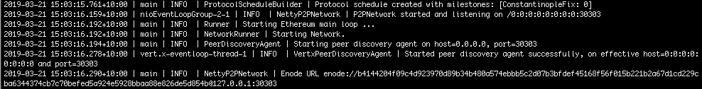

description: Configuring Privacy
<!--- END of page meta data -->

# Configuring a Network for Private Transactions 

### Prerequisites

* [Orion](https://docs.orion.pegasys.tech/en/latest/Installation/Overview/)

Configuring a network that supports private transactions requires starting an Orion node for each
Pantheon node. Pantheon command line options associate the Pantheon node with the Orion node. 

This tutorial assumes you have completed setting up an IBFT 2.0 network to the point where you have 
[created the genesis file](../../Tutorials/Create-IBFT-Network.md#5-create-genesis-file). If not, complete
steps 1 to 5 of the [Create an IBFT 2.0](../../Tutorials/Create-IBFT-Network.md) tutorial before continuing. 

!!! important 
    To support privacy, ensure your genesis file includes at least the `constantinopleFixBlock` milestone.

In this tutorial we start Orion nodes for the three Pantheon nodes and configure each Pantheon node to be associated 
with an Orion node. 

## 1. Create Orion Directories

Inside each `Node` directory, create an `Orion` directory: 

```bash
IBFT-Network/
├── Node-1
│   ├── data
│   ├── Orion
├── Node-2
│   ├── data
│   ├── Orion
└── Node-3
    ├── data
    ├── Orion 
```

## 2. Create Password Files
       
In each `Orion` directory, create a file called `passwordFile` containing a password to encrypt each Orion key pair. 

## 3. Generate Orion Keys
   
In each `Orion` directory, generate a public/private keypair for the Orion node:
   
``` bash
orion -g nodeKey
```
   
At the prompt, enter the [password](#2-create-password-files) saved in `passwordFile` to encrypt the key pair. 
   
The Orion public/private key pair is generated and the keys saved in the `nodeKey.pub` and `nodeKey.key` files.

## 4. Create Orion Configuration Files
   
In the `Node-1/Orion` directory, create a file called `orion.conf` and add the following properties:
   
```bash
nodeurl = "http://127.0.0.1:8080/"
nodeport = 8080
clienturl = "http://127.0.0.1:8888/"
clientport = 8888
publickeys = ["nodeKey.pub"]
privatekeys = ["nodeKey.key"]
passwords = "passwordFile"
tls = "off"
```

!!! important 
    In production systems, only specify [`tls`](http://docs.orion.pegasys.tech/en/latest/Configuring-Orion/Configuration-File/#tls)
    is `off` if another transport security mechanism such as WireGuard is in place. 
    
In the `Node-2/Orion` and `Node-3/Orion` directories, create `orion.conf` files specifying: 

* Different ports
* Node-1 Orion node as the bootnode (specified by [`othernodes`](http://docs.orion.pegasys.tech/en/latest/Configuring-Orion/Configuration-File/)): 

```bash tab="Node-2"
nodeurl = "http://127.0.0.1:8081/"
nodeport = 8081
clienturl = "http://127.0.0.1:8889/"
clientport = 8889
publickeys = ["nodeKey.pub"]
privatekeys = ["nodeKey.key"]
passwords = "passwordFile"
othernodes = ["http://127.0.0.1:8080/"]
tls = "off"
```

```bash tab="Node-3"
nodeurl = "http://127.0.0.1:8082/"
nodeport = 8082
clienturl = "http://127.0.0.1:8890/"
clientport = 8890
publickeys = ["nodeKey.pub"]
privatekeys = ["nodeKey.key"]
passwords = "passwordFile"
othernodes = ["http://127.0.0.1:8080/"]
tls = "off"
```
   
## 5. Start Orion Nodes
   
In each `Orion` directory, start Orion specifying the [configuration file](#3-create-a-configuration-file) created in the previous step:
   
```
orion orion.conf
``` 

## 6. Start Pantheon Node-1

In the `Node-1` directory, start Pantheon Node-1:

```bash tab="MacOS"
pantheon --data-path=data --genesis-file=../genesis.json --rpc-http-enabled --rpc-http-api=ETH,NET,IBFT,EEA,PRIV --host-whitelist="*" --rpc-http-cors-origins="all" --privacy-enabled --privacy-url=http://127.0.0.1:8888 --privacy-public-key-file=Orion/nodeKey.pub --min-gas-price=0   
```

```bash tab="Windows"
pantheon --data-path=data --genesis-file=..\genesis.json --rpc-http-enabled --rpc-http-api=ETH,NET,IBFT,EEA,PRIV --host-whitelist="*" --rpc-http-cors-origins="all" --privacy-enabled --privacy-url=http://127.0.0.1:8888 --privacy-public-key-file=Orion\nodeKey.pub --min-gas-price=0  
```

The command line specifies privacy options: 

* [`--privacy-enabled`](../../Reference/Pantheon-CLI-Syntax.md#privacy-enabled) enables privacy
* [`--privacy-url`](../../Reference/Pantheon-CLI-Syntax.md#privacy-url) specifies the Orion node URL (`clienturl` in `orion.conf`)
* [`--privacy-public-key-file`](../../Reference/Pantheon-CLI-Syntax.md#privacy-public-key-file) specifies the file containing
Orion node public key (created in [3. Generate Orion Keys](#3-generate-orion-keys))
* [`--rpc-http-api`](../../Reference/Pantheon-CLI-Syntax.md#rpc-http-api) includes `EEA` and `PRIV` in the list of 
JSON-RPC APIs to enable privacy JSON-RPC API methods.  
* [`--min-gas-price`](../../Reference/Pantheon-CLI-Syntax.md#min-gas-price) set to 0 for a [free gas network](../../Configuring-Pantheon/FreeGas.md).

When the node starts, the [enode URL](../../Configuring-Pantheon/Node-Keys.md#enode-url) is displayed.
Copy the enode URL to specify Node-1 as the bootnode in the following steps. 



### 7. Start Pantheon Node-2 

In the `Node-2` directory, start Pantheon Node-2 specifying the Node-1 enode URL copied when starting Node-1 as the bootnode:
 
```bash tab="MacOS"
pantheon --data-path=data --genesis-file=../genesis.json --bootnodes=<Node-1 Enode URL> --p2p-port=30304 --rpc-http-enabled --rpc-http-api=ETH,NET,IBFT,EEA,PRIV --host-whitelist="*" --rpc-http-cors-origins="all" --rpc-http-port=8546 --privacy-enabled --privacy-url=http://127.0.0.1:8889 --privacy-public-key-file=Orion/nodeKey.pub --min-gas-price=0   
```

```bash tab="Windows"
pantheon --data-path=data --genesis-file=..\genesis.json --bootnodes=<Node-1 Enode URL> --p2p-port=30304 --rpc-http-enabled --rpc-http-api=ETH,NET,IBFT,EEA,PRIV --host-whitelist="*" --rpc-http-cors-origins="all" --rpc-http-port=8546 --privacy-enabled --privacy-url=http://127.0.0.1:8889 --privacy-public-key-file=Orion\nodeKey.pub --min-gas-price=0   
```

The command line specifies the same options as for Node-1 with different ports and Orion node URL.  The 
[`--bootnodes`](../../Reference/Pantheon-CLI-Syntax.md#bootnodes) option specifies the enode URL for Node-1.

!!!note
    When running Pantheon from the [Docker image](../../Getting-Started/Run-Docker-Image.md), [expose ports](../../Getting-Started/Run-Docker-Image.md#exposing-ports).

### 8. Start Pantheon Node-3

In the `Node-3` directory and start Pantheon Node-3 specifying the Node-1 enode URL copied when starting Node-1 as the bootnode: 

```bash tab="MacOS"
pantheon --data-path=data --genesis-file=../genesis.json --bootnodes=<Node-1 Enode URL> --p2p-port=30305 --rpc-http-enabled --rpc-http-api=ETH,NET,IBFT,EEA,PRIV --host-whitelist="*" --rpc-http-cors-origins="all" --rpc-http-port=8547 --privacy-enabled --privacy-url=http://127.0.0.1:8890 --privacy-public-key-file=Orion/nodeKey.pub --min-gas-price=0   
```

```bash tab="Windows"
pantheon --data-path=data --genesis-file=..\genesis.json --bootnodes=<Node-1 Enode URL> --p2p-port=30305 --rpc-http-enabled --rpc-http-api=ETH,NET,IBFT,EEA,PRIV --host-whitelist="*" --rpc-http-cors-origins="all" --rpc-http-port=8547 --privacy-enabled --privacy-url=http://127.0.0.1:8890 --privacy-public-key-file=Orion\nodeKey.pub --min-gas-price=0  
```

The command line specifies the same options as for Node-1 with different ports and Orion node URL.  The 
[`--bootnodes`](../../Reference/Pantheon-CLI-Syntax.md#bootnodes) option specifies the enode URL for Node-1.

