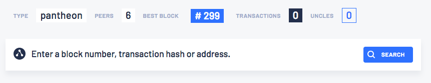
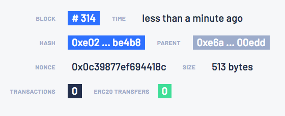
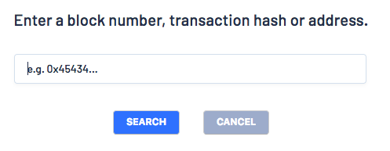

description: Pantheon private network quickstart tutorial
<!--- END of page meta data -->

# Private Network Quickstart Tutorial

The Private Network Quickstart uses the Pantheon Docker image to run a private network of Pantheon nodes managed by Docker Compose.

!!! important 
    The Private Network Quickstart runs a private network suitable for education or demonstration purposes. 
    The Private Network Quickstart is not intended for running production networks. 

## Prerequisites

To run this tutorial, you must have the following installed:

- MacOS or Linux 
    
    !!! important 
        The Private Network Quickstart is not supported on Windows. If using Windows, run the quickstart
        inside a Linux VM such as Ubuntu. 

- [Docker and Docker-compose](https://docs.docker.com/compose/install/) 

- [Git command line](https://git-scm.com/)

- [Curl command line](https://curl.haxx.se/download.html) 

- A web browser that supports [Metamask](https://metamask.io/) (currently Chrome, Firefox, Opera, and Brave), and has 
the MetaMask plug-in installed. This tutorial uses screenshots from Brave.


## Clone Pantheon Quickstart Source Code

Clone the repository from the `pantheon-quickstart` repository where `<version>` is replaced with the latest version (for example, `0.8.5`):

```bash tab="Linux/MacOS"
git clone --branch <version> https://github.com/PegaSysEng/pantheon-quickstart.git
```

```bash tab="Example"
git clone --branch 0.8.5 https://github.com/PegaSysEng/pantheon-quickstart.git
```


## Build Docker Images and Start Services and Network
 
This tutorial uses [Docker Compose](https://docs.docker.com/compose/) to assemble the images and 
run the private network. To build the docker images and run the containers, go to the `pantheon-quickstart` directory and run:

```bash tab="Linux/MacOS"
./run.sh
```

The `run.sh` script builds the images, and runs the containers. It also scales the regular node 
container to four containers to simulate a network with enough peers to synchronize.

When the process ends, it lists the running services:

!!! example "Docker-compose services list example"
    ```log
            Name                       Command               State                              Ports                           
    -----------------------------------------------------------------------------------------------------------------------------
    quickstart_bootnode_1    /opt/pantheon/bootnode_sta ...   Up      30303/tcp, 8545/tcp, 8546/tcp                              
    quickstart_explorer_1    nginx -g daemon off;             Up      0.0.0.0:32770->80/tcp                                      
    quickstart_minernode_1   /opt/pantheon/node_start.s ...   Up      30303/tcp, 8545/tcp, 8546/tcp                              
    quickstart_node_1        /opt/pantheon/node_start.s ...   Up      30303/tcp, 8545/tcp, 8546/tcp                              
    quickstart_node_2        /opt/pantheon/node_start.s ...   Up      30303/tcp, 8545/tcp, 8546/tcp                              
    quickstart_node_3        /opt/pantheon/node_start.s ...   Up      30303/tcp, 8545/tcp, 8546/tcp                              
    quickstart_node_4        /opt/pantheon/node_start.s ...   Up      30303/tcp, 8545/tcp, 8546/tcp                              
    quickstart_rpcnode_1     /opt/pantheon/node_start.s ...   Up      30303/tcp, 0.0.0.0:32769->8545/tcp, 0.0.0.0:32768->8546/tcp
    ```

Followed by a list of the endpoints:

!!! example "Endpoint list example"
    ```log
    ****************************************************************
    JSON-RPC HTTP service endpoint      : http://localhost:32770/jsonrpc   *
    JSON-RPC WebSocket service endpoint : ws://localhost:32770/jsonws   *
    Web block explorer address          : http://localhost:32770   *                                                                             
    ****************************************************************
    ```

- Use the **JSON-RPC HTTP service endpoint** to access the RPC node service from your Dapp or from cryptocurrency
wallets such as Metamask.
- Use the **JSON-RPC WebSocket service endpoint** to access the web socket node service from your Dapp.
- Use the **Web block explorer address** to display the block explorer web application. View the block explorer by
entering the URL in your web browser.

To display the list of endpoints again, run:

```bash tab="Linux/MacOS"
./list.sh
```

## Block Explorer

This tutorial uses the [Alethio](https://aleth.io/) light block explorer.

### Run the Block Explorer

Access the explorer by copying and pasting the `Web block explorer address` displayed when starting the private network
to your browser.

The block explorer displays a summary of the private network:



Notice that the explorer indicates 6 peers: the 4 regular nodes, the mining node and the bootnode.

Click the block number to the right of **Best Block** to display the block details:



You can explore blocks by clicking on the blocks under **Bk** on the left-hand side.

You can search for a specific block, transaction hash, or address by clicking the magnifying glass in the top left-hand corner.




## Run JSON-RPC Requests 

You can run RPC requests on `rpcnode`, the node exposed to the host in order to listen for requests. This tutorial uses 
[cURL](https://curl.haxx.se/download.html) to make JSON-RPC requests.

For the RPC URL, this tutorial uses the placeholder `<http-rpc-endpoint>`. When you run the tutorial, 
replace this placeholder with the JSON-RPC HTTP service endpoint provided when you list the endpoints. (For example,
`http://localhost:32770/jsonrpc`.) The dynamic docker port mapping changes each time you run the network.


### Requesting the Node Version

Run the following command from the host shell:

```bash
curl -X POST --data '{"jsonrpc":"2.0","method":"web3_clientVersion","params":[],"id":1}' <http-rpc-endpoint>
```

The result specifies the client version: 

```json
{
   "jsonrpc" : "2.0",
   "id" : 1,
   "result" : "pantheon/1.0.0"
}
```
Here we simply query the version of the Pantheon node, which confirms the node is running.

Successfully calling this method shows that you can connect to the nodes via RPC. From here, you can walk through more 
interesting requests demonstrated in the rest of this section, or skip ahead to 
[Creating a Transaction Using MetaMask](#creating-a-transaction-using-metamask).

### Counting Peers

Peers are the number of other nodes connected to the RPC node.

Poll the peer count using `net_peerCount`:

```bash
curl -X POST --data '{"jsonrpc":"2.0","method":"net_peerCount","params":[],"id":1}' <http-rpc-endpoint>
```

The result indicates that there are 6 peers:

```json
{
  "jsonrpc" : "2.0",
  "id" : 1,
  "result" : "0x6"
}
```

### Requesting the Most Recently Mined Block Number  

Call `eth_blockNumber` to retrieve the number of the most recent block:

```bash
curl -X POST --data '{"jsonrpc":"2.0","method":"eth_blockNumber","params":[],"id":1}' <http-rpc-endpoint>
```

The result provides the most recently mined block:

```json
{
  "jsonrpc" : "2.0",
  "id" : 1,
  "result" : "0x8b8"
}
```

The hexadecimal value `0x8b8` translates to `2232` in decimal, the number of blocks that have been mined so far.

### Checking the Miner Account Balance 

Call `eth_getBalance` to retrieve the balance of the mining address (coinbase) defined in the miner node:

```bash
curl -X POST --data '{"jsonrpc":"2.0","method":"eth_getBalance","params":["0xfe3b557e8fb62b89f4916b721be55ceb828dbd73","latest"],"id":1}' <http-rpc-endpoint>
```

The result specifies the miner account balance:

```json
{
  "jsonrpc" : "2.0",
  "id" : 1,
  "result" : "0x79f905c6fd34e80000"
}
```

!!!info
    0x79f905c6fd34e80000 = 2250000000000000000000 Wei (2250 Ether).
!!!tip
    Use a [unit converter](https://etherconverter.online/) to easily translate values from Wei to Ether.

Wait several seconds until new blocks are mined and call `eth_getBalance` again. The balance increases, meaning the miner
address successfully received the mining reward.

You can also view this information in the block explorer. It does exactly the same thing as this call, connecting
to the RPC node using HTTP JSON-RPC, and displaying information on a web page.


## Creating a Transaction Using MetaMask

Now let's use [MetaMask](https://metamask.io/) to send transactions.

Before sending transactions, you need to create an account or use one of the accounts below created during the genesis
of this private test network.

{!global/test_accounts.md!}

!!!note
    Pantheon doesn't implement [account management](../Using-Pantheon/Account-Management.md). To create your own account, 
    you have to use a third-party tool such as MetaMask.

After you sign in to MetaMask, connect to the private network RPC endpoint:

1. In the MetaMask network list, select **Custom RPC**.
1. In the **New RPC URL** field, enter the JSON-RPC HTTP service endpoint displayed when you started the private network.

Save the configuration and return to the MetaMask main screen. Your current network is now set to the private network RPC node.

[Import one of the existing accounts above into MetaMask](https://metamask.zendesk.com/hc/en-us/articles/360015489331-Importing-an-Account-New-UI-)
using the corresponding private key.

!!!note
    In this tutorial, we don't need to secure the keys, because we're using a private test network to send valueless 
    Ether. However, be sure to secure your accounts in a real use case on the main Ethereum network (MainNet).

Once this is done, [create another account from scratch](https://metamask.zendesk.com/hc/en-us/articles/360015289452-Creating-Additional-MetaMask-Wallets-New-UI-)
to send Ether to.

In MetaMask, select the new account and copy the account address by clicking the **...** gadget and selecting 
**Copy Address to clipboard**.

In the block explorer, search for the new account by clicking on the magnifying glass and pasting the account address
into the search box. The account is displayed with a zero balance. 

[Send Ether](https://metamask.zendesk.com/hc/en-us/articles/360015488991-Sending-Ether-New-UI-) from the first account 
(containing ether) to the new one (which has a zero balance).

Refresh the browser page that displays the new account. The updated balance is displayed and reflects the transaction
completed using MetaMask.


## Truffle Pet Shop Tutorial

With a few modifications, we can use the private network in this tutorial as the blockchain for the 
[PetShop tutorial on Truffle website](https://truffleframework.com/tutorials/pet-shop).

#### Prerequisites

* [Node.js v6+ LTS and npm](https://nodejs.org/en/) (comes with Node)

#### Install Truffle and Unpack Truffle Box

Install Truffle :

```bash
npm install -g truffle
```

!!! note
    `npm` requires `sudo` on Linux.

Create a `pet-shop-tutorial` directory and move into it:

```bash
mkdir pet-shop-tutorial

cd pet-shop-tutorial
```

Unpack Pet Shop [Truffle box](https://truffleframework.com/boxes): 

`truffle unbox pet-shop`

Install the [Truffle wallet](https://github.com/trufflesuite/truffle-hdwallet-provider):
Note with Truffle 5, you must use a Web3 1.0 enabled wallet or the Truffle tasks will hang.

```bash
npm install --save truffle-hdwallet-provider@web3-one
```

!!!note
    `npm` requires `sudo` on Linux.

#### Modify the Pet Shop Example

Modify the `truffle-config.js` file in the `pet-shop-tutorial` directory to add our wallet provider. The following shows the
code with placeholders to change as directed below:

```javascript
const PrivateKeyProvider = require("truffle-hdwallet-provider");
const privateKey = "8f2a55949038a9610f50fb23b5883af3b4ecb3c3bb792cbcefbd1542c692be63";
const privateKeyProvider = new PrivateKeyProvider(privateKey, "<YOUR HTTP RPC NODE ENDPOINT>");

module.exports = {
  // See <http://truffleframework.com/docs/advanced/configuration>
  // for more about customizing your Truffle configuration!
  networks: {
    development: {
      host: "127.0.0.1",
      port: 7545,
      network_id: "*" // Match any network id
    },
    quickstartWallet: {
      provider: privateKeyProvider,
      network_id: "*"
    },
  }
};
```

Replace `<YOUR HTTP RPC NODE ENDPOINT>` with your HTTP RPC node endpoint (for example, `http://localhost:32770/jsonrpc`).

The private key is the miner address, which contains Ether. 

Once this is done, follow the [Truffle tutorial steps](https://truffleframework.com/tutorials/pet-shop#directory-structure)
up to Step 3 in the [Migration section](https://truffleframework.com/tutorials/pet-shop#migration).

We're using the private network instead of [Ganache](https://truffleframework.com/ganache), so skip steps 3, 4, and 5 in
the [Migration section](https://truffleframework.com/tutorials/pet-shop#migration). 

In step 4, specify the private network: 

```bash
truffle migrate --network quickstartWallet
```

Output similar to the following is displayed (your addresses will differ):

```log
Using network 'quickstartWallet'.

Running migration: 1_initial_migration.js
  Deploying Migrations...
  ... 0xfc1dbc1eaa14fa283c2c4415364579da0d195b3f2f2fefd7e0edb600a6235bdb
  Migrations: 0x9a3dbca554e9f6b9257aaa24010da8377c57c17e
Saving successful migration to network...
  ... 0x77cc6e9966b886fb74268f118b3ff44cf973d32b616ed4f050b3eabf0a31a30e
Saving artifacts...
Running migration: 2_deploy_contracts.js
  Deploying Adoption...
  ... 0x5035fe3ea7dab1d81482acc1259450b8bf8fefecfbe1749212aca86dc765660a
  Adoption: 0x2e1f232a9439c3d459fceca0beef13acc8259dd8
Saving successful migration to network...
  ... 0xa7b5a36e0ebc9c25445ce29ff1339a19082d0dda516e5b72c06ee6b99a901ec0
Saving artifacts...
```

Search for the deployed contracts and transactions in the block explorer using the addresses displayed in your output.

Continue with the Truffle tutorial steps in the [Testing the smart contract](https://truffleframework.com/tutorials/pet-shop#testing-the-smart-contract) section.

To run the tests in the [Running the tests](https://truffleframework.com/tutorials/pet-shop#running-the-tests) section,
specify the private network: 

```bash
truffle test --network quickstartWallet
```

Output similar to the following is displayed: 
```log
Using network 'quickstartWallet'.

Compiling ./contracts/Adoption.sol...
Compiling ./test/TestAdoption.sol...
Compiling truffle/Assert.sol...
Compiling truffle/DeployedAddresses.sol...


  TestAdoption
    ✓ testUserCanAdoptPet (2071ms)
    ✓ testGetAdopterAddressByPetId (6070ms)
    ✓ testGetAdopterAddressByPetIdInArray (6077ms)


  3 passing (37s)
```

Continue with the Truffle tutorial steps in the [Creating a user interface to interact with the smart contract](https://truffleframework.com/tutorials/pet-shop#creating-a-user-interface-to-interact-with-the-smart-contract) section.

We've already connected the private network to MetaMask, so you can skip the [Installing and configuring MetaMask](https://truffleframework.com/tutorials/pet-shop#installing-and-configuring-metamask) section.

Continue with the regular tutorial steps from the [Installing and configuring lite-server](https://truffleframework.com/tutorials/pet-shop#installing-and-configuring-lite-server)
section and finish the tutorial.

When you adopt pets in the browser and approve the transaction in MetaMask, you'll be able to see the transactions in the block explorer.


## Stop / Restart Private Network without Removing Containers 

To shut down the private network without deleting the containers:

```bash tab="Linux/MacOS"
./stop.sh
```

This command stops the containers related to the services specified in the `docker-compose.yml` file.

To restart the private network:

```bash tab="Linux/MacOS"
./start.sh
```

## Stop Private Network and Remove Containers

To shut down the private network and delete all containers and images created during the quickstart:

```bash tab="Linux/MacOS"
./remove.sh
```
